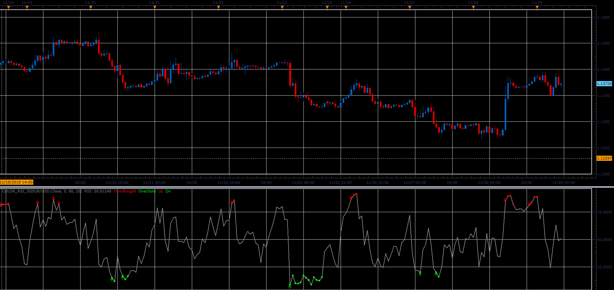

# Color RSI

> Source: https://fxcodebase.com/code/viewtopic.php?f=48&t=67080  
> Forum: 48 · Topic 67080 · 1 post(s)

---

## Color RSI

**Alexander.Gettinger** · Fri Dec 07, 2018 1:45 pm

The indicator highlights of RSI corresponding the conditions: RSI>OverBought or RSI<OverSold.
The arrows show the first entry in the zones.

 

Download:

 [Color_RSI_JS.jsl](files/122589/Color_RSI_JS.jsl)
