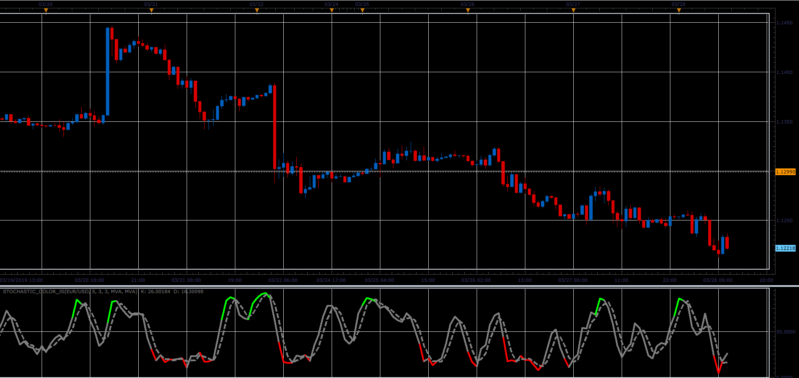

# Color stochastic

> Source: https://fxcodebase.com/code/viewtopic.php?f=48&t=68279  
> Forum: 48 · Topic 68279 · 1 post(s)

---

## Color stochastic

**Alexander.Gettinger** · Sat Mar 30, 2019 4:05 pm

Stochastic change color when it is upper than overbought level or lower than oversold level.

 

Download:

 [Stochastic_Color_JS.jsl](files/125499/Stochastic_Color_JS.jsl)
