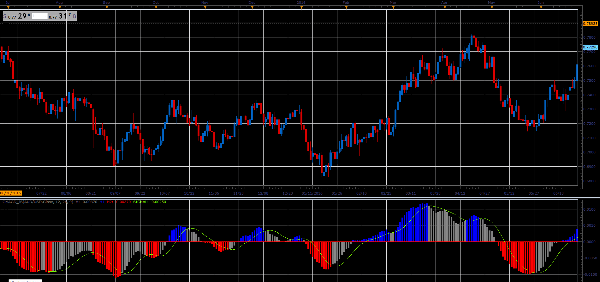

# Colorful MACD

> Source: https://fxcodebase.com/code/viewtopic.php?f=48&t=66010  
> Forum: 48 · Topic 66010 · 1 post(s)

---

## Colorful MACD

**Alexander.Gettinger** · Tue May 01, 2018 11:34 am

This is the usual MACD indicator with the following features:
Unlike the standard TS implementation this indicator shows the MACD as a histogram and SIGNAL as a line (the standard indicator shows MACD and SIGNAL as lines and the difference between MACD and SIGNAL as a histogram)
The histogram bars are colored in case the bar is above (below) the signal line. The same coloring is used in MT4 Golden MACD indicator.

Formula:
MACD = EMA(price, short) - EMA(price, long)
SIGNAL = MVA(MACD, signal)

 

Download:

 [GMACD_JS.jsl](files/118936/GMACD_JS.jsl)
