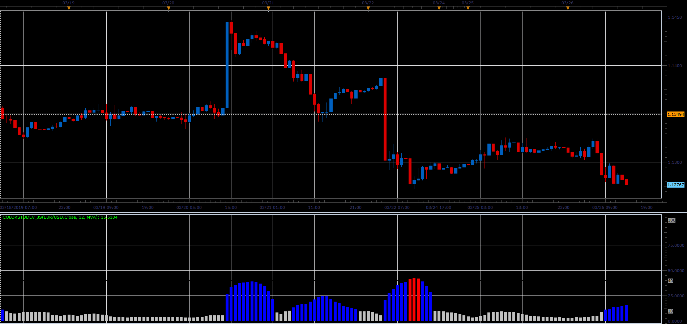

# ColorStdDev indicator

> Source: https://fxcodebase.com/code/viewtopic.php?f=48&t=68260  
> Forum: 48 · Topic 68260 · 1 post(s)

---

## ColorStdDev indicator

**Alexander.Gettinger** · Sat Mar 30, 2019 3:28 pm

ColorStdDev=StdDev/(Size of pip).
If ColorStdDev>MaxTrendLevel, indicator have a MaxTrendColor,
If ColorStdDev<MaxTrendLevel and ColorStrDev>MiddleTrendLevel, indicator have a MiddleTrendColor, etc.

 

Download:

 [ColorStdDev_JS.jsl](files/125480/ColorStdDev_JS.jsl)
