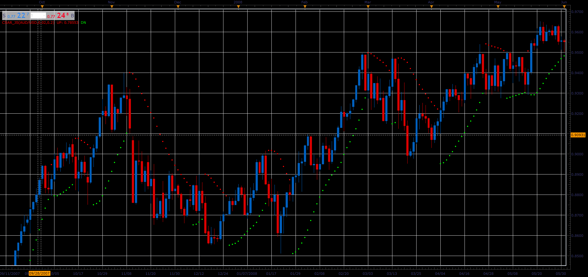

# Colour SAR

> Source: https://fxcodebase.com/code/viewtopic.php?f=48&t=65935  
> Forum: 48 · Topic 65935 · 1 post(s)

---

## Colour SAR

**Alexander.Gettinger** · Thu Apr 12, 2018 12:07 pm

This is a slightly modified version of the standard TS/Marketscope SAR indicator which:
- lets choose different color for up and down parts of SAR
- lets choose step and maximum values (default values are 0.02 and 0.2)

 

Download:

 [CSAR_JS.jsl](files/118649/CSAR_JS.jsl)
