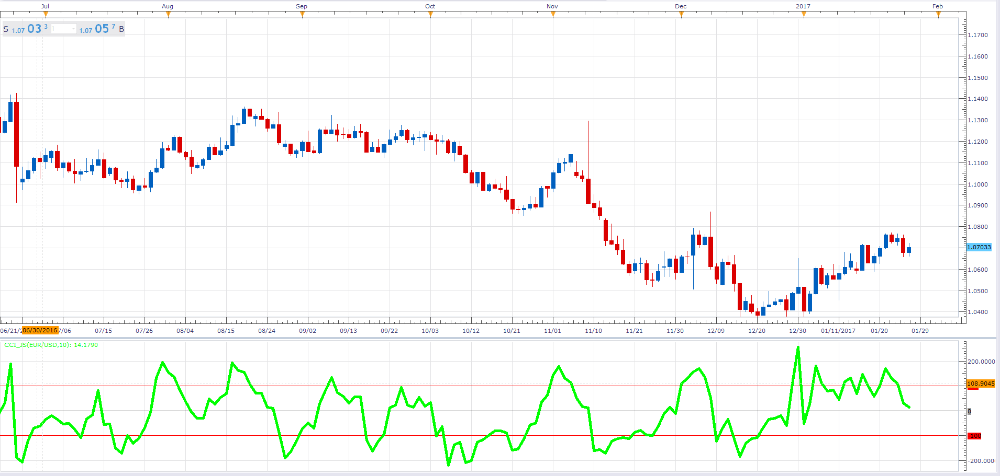

# Commodity Channel Index

> Source: https://fxcodebase.com/code/viewtopic.php?f=48&t=64355  
> Forum: 48 · Topic 64355 · 1 post(s)

---

## Commodity Channel Index

**Alexander.Gettinger** · Fri Jan 27, 2017 11:49 am

Commodity Channel Index (CCI) measures the deviation of the commodity price from its average statistical price.

 

Download:

 [CCI_JS.jsl](files/110747/CCI_JS.jsl)
