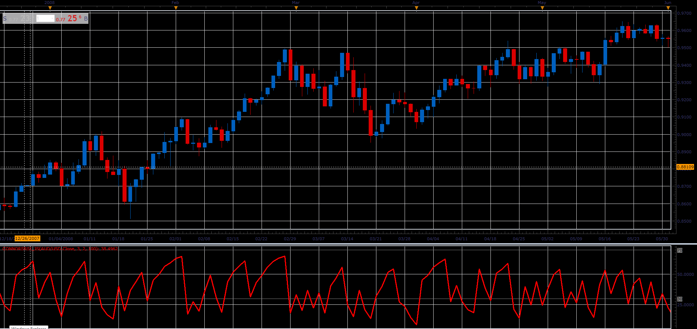

# ConnorsRSI oscillator

> Source: https://fxcodebase.com/code/viewtopic.php?f=48&t=65932  
> Forum: 48 · Topic 65932 · 1 post(s)

---

## ConnorsRSI oscillator

**Alexander.Gettinger** · Thu Apr 12, 2018 12:04 pm

Formula:
ConnorsRSI(3,2,100) = [ RSI(Close,3) + RSI(UpDownDays,2) + PercentRank(percentMove,100) ] / 3

 

Download:

 [ConnorsRSI_JS.jsl](files/118646/ConnorsRSI_JS.jsl)
