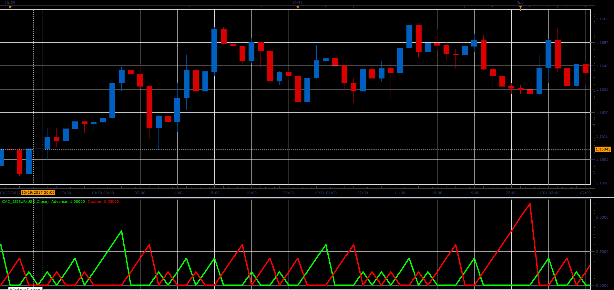

# Consecutive Advance / Decline

> Source: https://fxcodebase.com/code/viewtopic.php?f=48&t=65526  
> Forum: 48 · Topic 65526 · 1 post(s)

---

## Consecutive Advance / Decline

**Alexander.Gettinger** · Sat Jan 06, 2018 12:39 pm

The indicator shows number of consecutive advances or declines.

 

Download:

 [CAD_JS.jsl](files/116805/CAD_JS.jsl)
