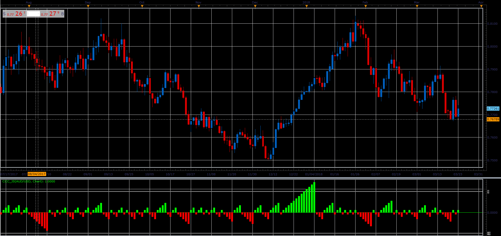

# Consecutive Candle Count

> Source: https://fxcodebase.com/code/viewtopic.php?f=48&t=65927  
> Forum: 48 · Topic 65927 · 1 post(s)

---

## Consecutive Candle Count

**Alexander.Gettinger** · Thu Apr 12, 2018 11:59 am

Indicator will add one each time a candle continues previous trend.
It is true for any on chart candles source, Heiken-Ashi can be choose as source.

 

Download:

 [CCC_JS.jsl](files/118641/CCC_JS.jsl)
