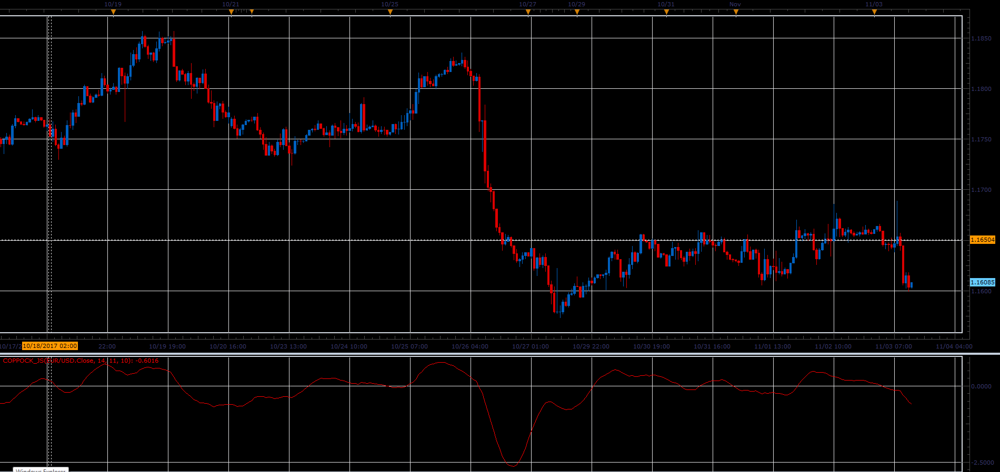

# Coppock Indicator

> Source: https://fxcodebase.com/code/viewtopic.php?f=48&t=65535  
> Forum: 48 · Topic 65535 · 1 post(s)

---

## Coppock Indicator

**Alexander.Gettinger** · Sat Jan 06, 2018 1:23 pm

The Coppock formula was introduced in Barron's Magazine in 1962 by Edwin Sedgwick Coppock.

A bull market is signaled when the Coppock Indicator turns up from below zero.
No sell signals are generated (it is not designed for that).
However there are some systems using Coppock sell signals.

Formula for calculating Coppock
Coppock[period] = LWMA (ROC[short]+ROC[long]).

 

Download:

 [Coppock_JS.jsl](files/116814/Coppock_JS.jsl)
