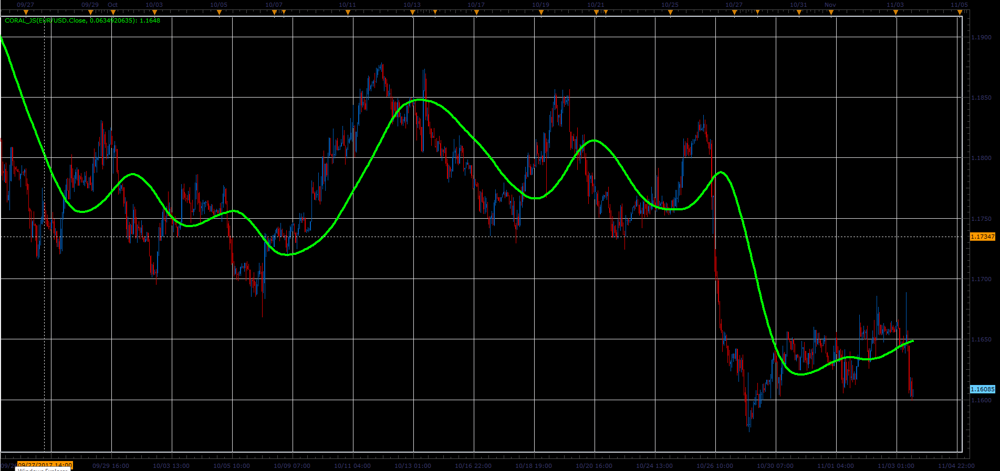

# Coral indicator

> Source: https://fxcodebase.com/code/viewtopic.php?f=48&t=65536  
> Forum: 48 · Topic 65536 · 1 post(s)

---

## Coral indicator

**Alexander.Gettinger** · Sat Jan 06, 2018 1:24 pm

Formulas:
Coral[i]=-0.064*Buff6[i]+0.672*Buff5[i]-2.352*Buff4[i]+2.744*Buff3[i], where
Buff6[i]=Coeff*Buff5[i]+(1-Coeff)*Buff6[i-1],
Buff5[i]=Coeff*Buff4[i]+(1-Coeff)*Buff5[i-1],
Buff4[i]=Coeff*Buff3[i]+(1-Coeff)*Buff4[i-1],
Buff3[i]=Coeff*Buff2[i]+(1-Coeff)*Buff3[i-1],
Buff2[i]=Coeff*Buff1[i]+(1-Coeff)*Buff2[i-1],
Buff1[i]=Coeff*Price+(1-Coeff)*Buff1[i-1].

 

Download:

 [Coral_JS.jsl](files/116815/Coral_JS.jsl)
