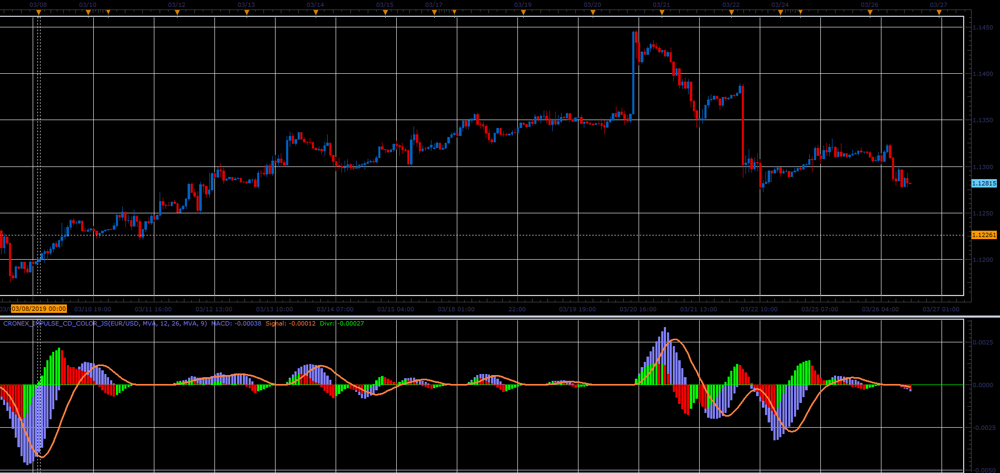

# Cronex Impulse CD Color oscillator

> Source: https://fxcodebase.com/code/viewtopic.php?f=48&t=68207  
> Forum: 48 · Topic 68207 · 1 post(s)

---

## Cronex Impulse CD Color oscillator

**Alexander.Gettinger** · Sat Mar 30, 2019 11:21 am

Formulas:
MACD = Fast_MA - Slow_MA_H, if Fast_MA>Slow_MA_H,
MACD = Fast_MA - Slow_MA_L, if Fast_MA<=Slow_MA_H,
Signal = MA(MACD, Signal_Period),
Divr = MACD - Signal, where
Fast_MA = MA(Weighted price, Fast_Period),
Slow_MA_H = MA(High price, Slow_Period),
Slow_MA_L = MA(Low price, Slow_Period).

 

Download:

 [Cronex_Impulse_CD_Color_JS.jsl](files/125426/Cronex_Impulse_CD_Color_JS.jsl)

For this indicator must be installed Averages indicator ([viewtopic.php?f=17&t=2430](https://fxcodebase.com/code/viewtopic.php?f=17&t=2430)).
