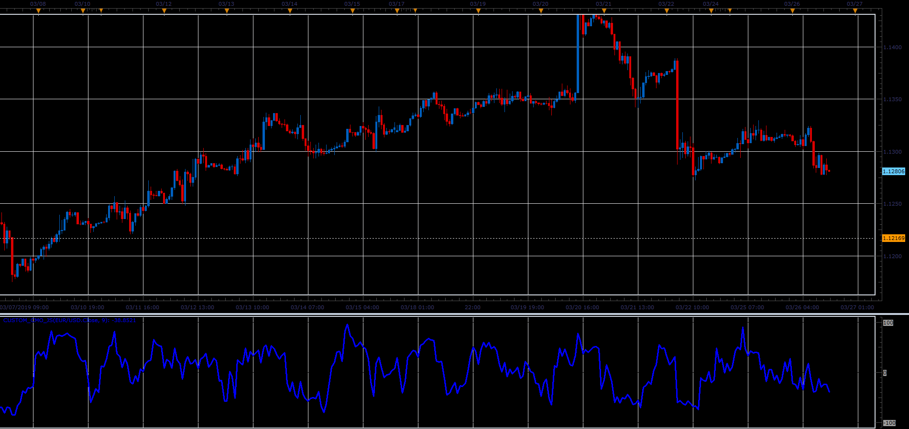

# Custom Chande Momentum Oscillator (CMO)

> Source: https://fxcodebase.com/code/viewtopic.php?f=48&t=68209  
> Forum: 48 · Topic 68209 · 3 post(s)

---

## Custom Chande Momentum Oscillator (CMO)

**Alexander.Gettinger** · Sat Mar 30, 2019 11:25 am

Download:

 [Custom_CMO_JS.jsl](files/125428/Custom_CMO_JS.jsl)

---

## Re: Custom Chande Momentum Oscillator (CMO)

**xristos1982** · Wed May 24, 2023 2:56 pm

Can i have this in Lua(with a zero line) please?Thank you

---

## Re: Custom Chande Momentum Oscillator (CMO)

**Apprentice** · Thu Jun 01, 2023 1:58 pm

Try this version.
[https://fxcodebase.com/code/viewtopic.php?f=17&t=73785](https://fxcodebase.com/code/viewtopic.php?f=17&t=73785)
