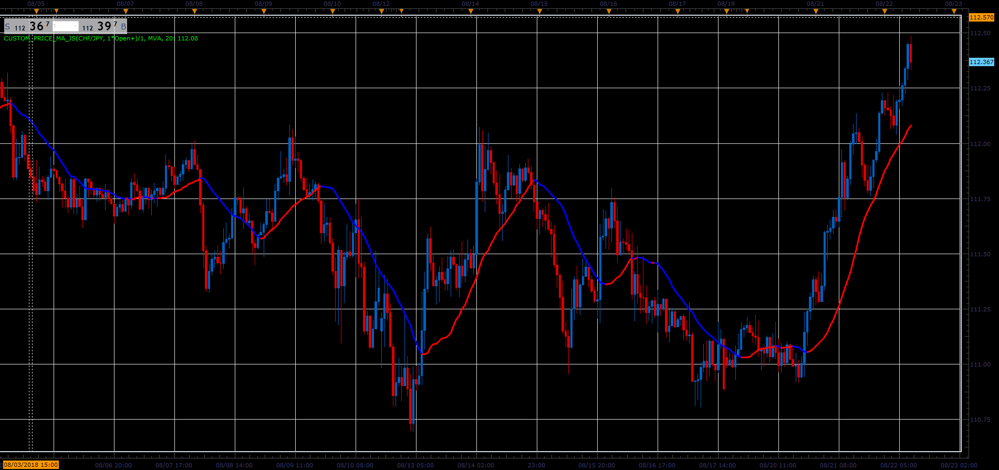

# Custom price MA

> Source: https://fxcodebase.com/code/viewtopic.php?f=48&t=66967  
> Forum: 48 · Topic 66967 · 1 post(s)

---

## Custom price MA

**Alexander.Gettinger** · Sat Nov 24, 2018 12:22 pm

Formulas:
Custom price MA = MA(Custom price), where
Custom price = (Open_Coeff*Open+High_Coeff*High+Low_Coeff*Low+Close_Coeff*Close)/Sum_Coeff,
Sum_Coeff = Open_Coeff+High_Coeff+Low_Coeff+Close_Coeff.

 

Download:

 [Custom_Price_MA_JS.jsl](files/122295/Custom_Price_MA_JS.jsl)

For this indicator must be installed Averages indicator ([viewtopic.php?f=17&t=2430](https://fxcodebase.com/code/viewtopic.php?f=17&t=2430)).
