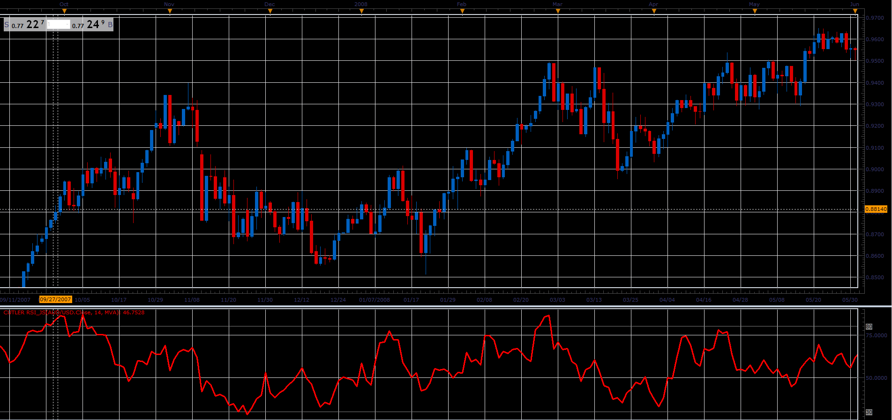

# Cutler's RSI

> Source: https://fxcodebase.com/code/viewtopic.php?f=48&t=65936  
> Forum: 48 · Topic 65936 · 1 post(s)

---

## Cutler's RSI

**Alexander.Gettinger** · Thu Apr 12, 2018 12:08 pm

A variation of RSI called Cutler's RSI is based on a simple moving average,
instead of the exponential average Wilder's RSI uses.

 

Download:

 [Cutler RSI_JS.jsl](files/118650/Cutler%20RSI_JS.jsl)
