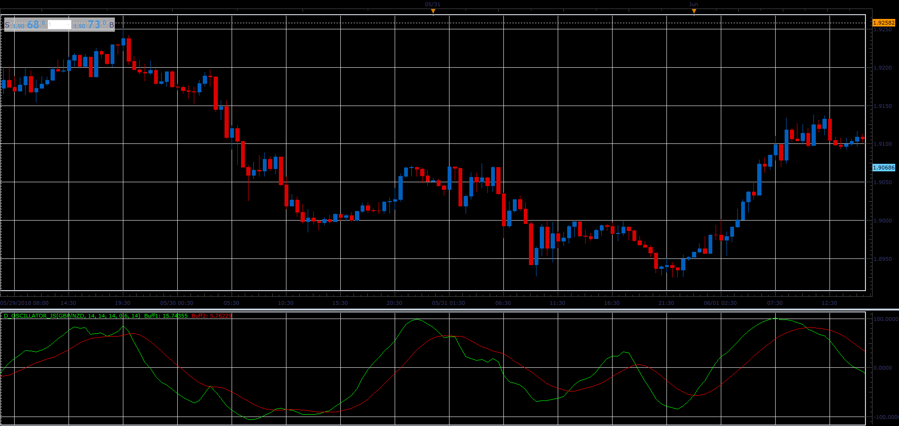

# D oscillator

> Source: https://fxcodebase.com/code/viewtopic.php?f=48&t=66520  
> Forum: 48 · Topic 66520 · 1 post(s)

---

## D oscillator

**Alexander.Gettinger** · Wed Aug 15, 2018 2:25 pm

Oscillator based on two indicators: RSI and CCI.

Formulas:
Line1[i]=2/(Smooth+1)*StCCI+(1-2/(Smooth+1))*Line1[i-1],
Line2[i]=2/(Smooth*0.8+1)*Line1[i-1]+(1-2/(Smooth*0.8+1))*Line2[i-1], where
StCCI=[CCI_Coeff]*CCI[i]+(1-[CCI_Coeff])*StRSI,
StRSI=(RSI[i]-MinRSI)*200/(MaxRSI-MinRSI)-100,
MaxRSI, MinRSI is a maximum and minimum of RSI from [i-D_Period] to [i].

 

Download:

 [D_Oscillator_JS.jsl](files/120582/D_Oscillator_JS.jsl)
