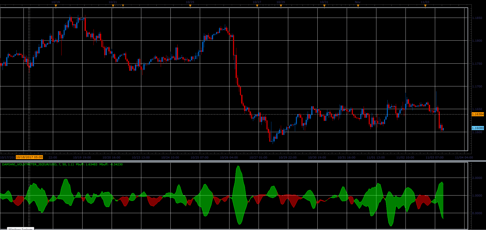

# Damiani volatmeter oscillator

> Source: https://fxcodebase.com/code/viewtopic.php?f=48&t=65537  
> Forum: 48 · Topic 65537 · 1 post(s)

---

## Damiani volatmeter oscillator

**Alexander.Gettinger** · Sat Jan 06, 2018 1:25 pm

The indicator measures the volatility and shows it in as colored stripes.

 

Download:

 [Damiani_Volatmeter_JS.jsl](files/116816/Damiani_Volatmeter_JS.jsl)
