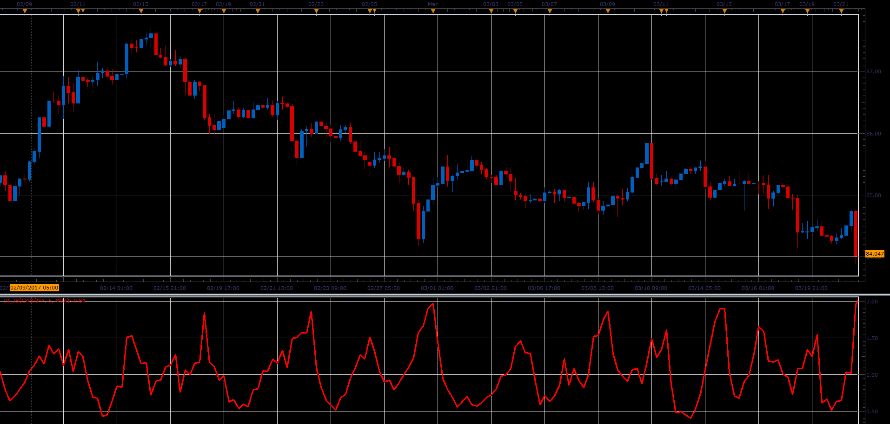

# Damping index

> Source: https://fxcodebase.com/code/viewtopic.php?f=48&t=64768  
> Forum: 48 · Topic 64768 · 1 post(s)

---

## Damping index

**Alexander.Gettinger** · Mon Jun 05, 2017 12:31 pm

Formula:
DI[i] = (H_MA[i]-L_MA[i])/(H_MA[i-Period]-L_MA[i-Period]), where
H_MA - MA(High price) with [Period] number of periods and [Method] type,
L_MA - MA(Low price) with [Period] number of periods and [Method] type.

 

Download:

 [DI_JS.jsl](files/112779/DI_JS.jsl)
