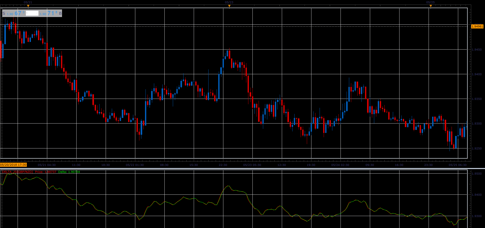

# Delta oscillator

> Source: https://fxcodebase.com/code/viewtopic.php?f=48&t=66521  
> Forum: 48 · Topic 66521 · 1 post(s)

---

## Delta oscillator

**Alexander.Gettinger** · Wed Aug 15, 2018 2:26 pm

Formula:
Delta[i] = Pr[i]+Diff[i], where
Diff[i] = Log10(Pr[i-1]/Pr[i]),
Pr[i] = (Open[i]+High[i]+Low[i]+Close[i])/4,
Log10 - common logarithm.

 

Download:

 [Delta_JS.jsl](files/120583/Delta_JS.jsl)
