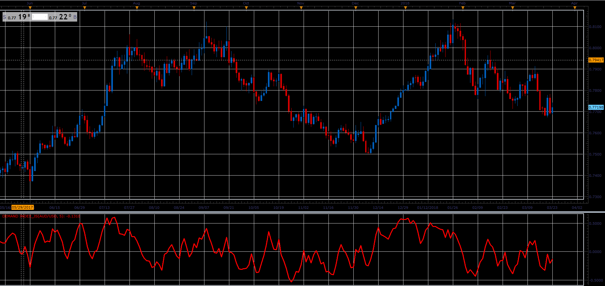

# Demand Index

> Source: https://fxcodebase.com/code/viewtopic.php?f=48&t=65981  
> Forum: 48 · Topic 65981 · 3 post(s)

---

## Demand Index

**Alexander.Gettinger** · Tue May 01, 2018 10:42 am

The Demand Index, developed by James Sibbet, combines price and volume,
it is often a leading indicator of price change.

Mr. Sibbet defined six "rules" for the Demand Index

1.A divergence between the Demand Index and prices suggests an approaching weakness in price.
2.Prices often rally to new highs following an extreme peak in the Demand Index (the Index is performing as a leading indicator).
3.Higher prices with a lower Demand Index peak usually coincides with an important top (the Index is performing as a coincidental indicator).
4.The Demand Index penetrating the level of zero indicates a change in trend (the Index is performing as a lagging indicator).
5.When the Demand Index stays near the level of zero for any length of time, it usually indicates a weak price movement that will not last long.
6,A large long-term divergence between prices and the Demand Index indicates a major top or bottom.

 

Download:

 [Demand Index_JS.jsl](files/118906/Demand%20Index_JS.jsl)

---

## Re: Demand Index

**logicgate** · Thu Dec 13, 2018 7:58 am

Brother would be so kind to compile an updated MT4 version?

God Bless, thanks!

---

## Re: Demand Index

**Apprentice** · Thu Dec 13, 2018 10:49 am

Try it now.
[viewtopic.php?f=38&t=61625](https://fxcodebase.com/code/viewtopic.php?f=38&t=61625)
