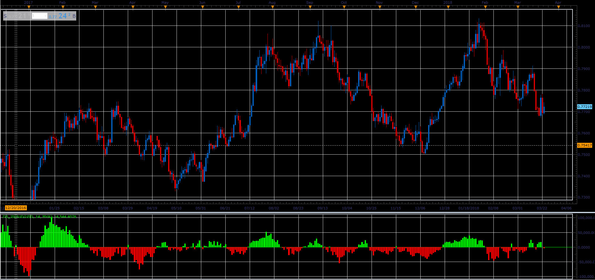

# Demand - Supply oscillator

> Source: https://fxcodebase.com/code/viewtopic.php?f=48&t=65987  
> Forum: 48 · Topic 65987 · 1 post(s)

---

## Demand - Supply oscillator

**Alexander.Gettinger** · Tue May 01, 2018 10:49 am

Formulas:
DS = MA(Raw, Length, Method), where
Raw = (Abs((Close-Low)/(High-Low))-Abs((High-Close)/(High-Low)))*Volume.

 

Download:

 [DS_JS.jsl](files/118912/DS_JS.jsl)
