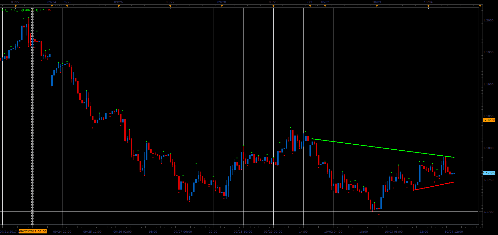

# Demark Trend Lines

> Source: https://fxcodebase.com/code/viewtopic.php?f=48&t=65278  
> Forum: 48 · Topic 65278 · 1 post(s)

---

## Demark Trend Lines

**Alexander.Gettinger** · Sat Oct 28, 2017 12:09 pm

Demark trend lines are drawn from Swing High and Swing Low points.
Swing High is a local maximum, which preceded or followed by a lower maximum candles.
Swing Low is a local minimum, which preceded or followed by a higher minimum candles.

Demark trend lines Crossover gives a Buy or Sell signals.

Distance from the trend line to the farthest extremes is equal to the distance from the point of breaking a trend line to the profit goal.

 

Download:

 [TD_Lines_JS.jsl](files/115703/TD_Lines_JS.jsl)
