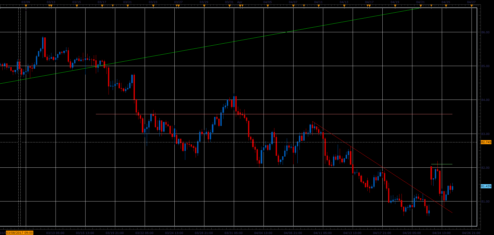

# Demark Trend Lines

> Source: https://fxcodebase.com/code/viewtopic.php?f=48&t=64781  
> Forum: 48 · Topic 64781 · 1 post(s)

---

## Demark Trend Lines

**Alexander.Gettinger** · Mon Jun 12, 2017 10:44 am

Demark trend lines are drawn from Swing High and Swing Low points.
Swing High is a local maximum, which preceded or followed by a lower maximum candles.
Swing Low is a local minimum, which preceded or followed by a higher minimum candles.

Demark trend lines Crossover gives Buy or Sell signals.

 

Download:

 [DTL_JS.jsl](files/112851/DTL_JS.jsl)
