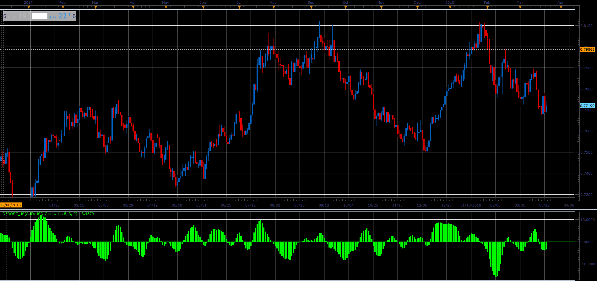

# Derivative Oscillator

> Source: https://fxcodebase.com/code/viewtopic.php?f=48&t=65982  
> Forum: 48 · Topic 65982 · 1 post(s)

---

## Derivative Oscillator

**Alexander.Gettinger** · Tue May 01, 2018 10:43 am

Formula:
DEROSC = EMA2-MVA(EMA2, MVA_Length), where
EMA2 = EMA(EMA1) with [EMA2_Length] number of periods,
EMA1 = EMA(RSI) with [EMA1_Length] number of periods,
RSI - Relative Strength Index with [RSI_Length] number of periods.

 

Download:

 [DEROSC_JS.jsl](files/118907/DEROSC_JS.jsl)
