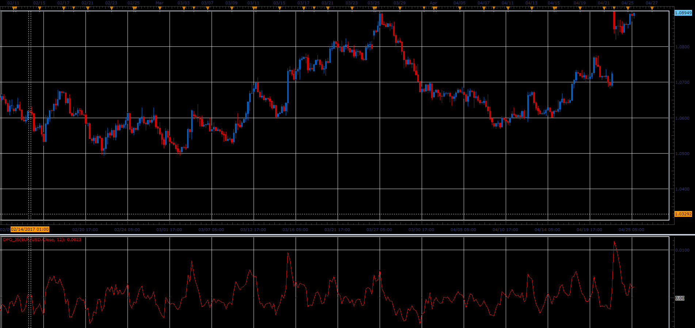

# Detrend Price Oscillator

> Source: https://fxcodebase.com/code/viewtopic.php?f=48&t=64711  
> Forum: 48 · Topic 64711 · 1 post(s)

---

## Detrend Price Oscillator

**Alexander.Gettinger** · Fri Jun 02, 2017 1:40 pm

Formula:
DPO = Price-Avg, where
Avg - average price at range from (i-N) to (i).

 

Download:

 [DPO_JS.jsl](files/112700/DPO_JS.jsl)
