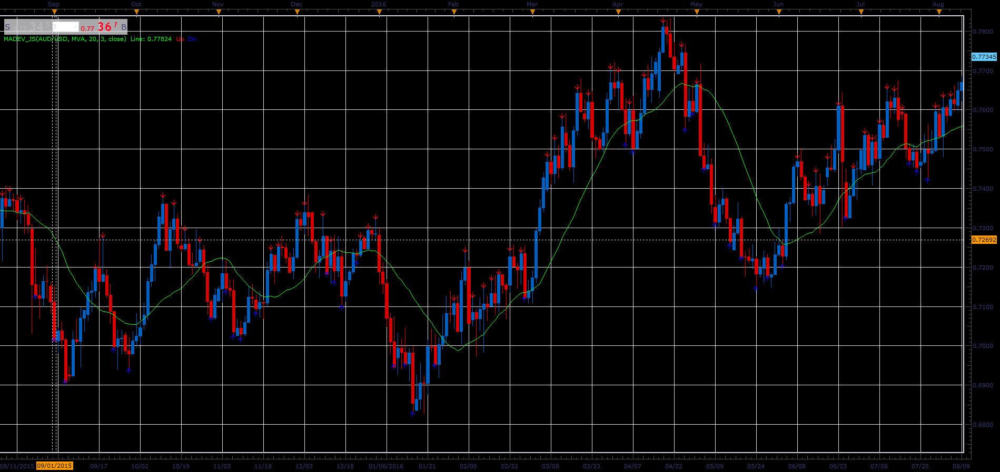
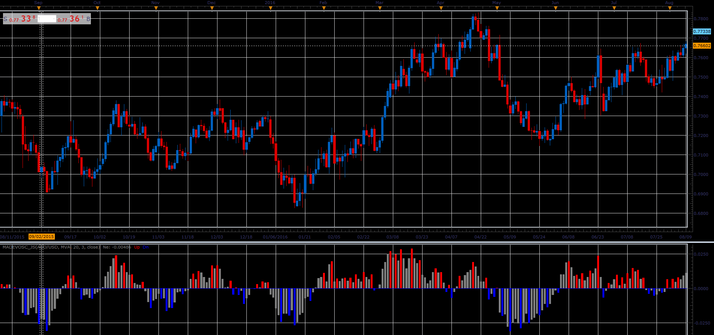

# Deviation from MA

> Source: https://fxcodebase.com/code/viewtopic.php?f=48&t=66048  
> Forum: 48 · Topic 66048 · 1 post(s)

---

## Deviation from MA

**Alexander.Gettinger** · Wed May 02, 2018 11:47 am

The indicator shows deviation between MA and price.
For find the maximums used [Frame] bars (as for fractals).
Arrow are shown maximums of the deviation of the price from MA.

 

Download:

 [MaDev_JS.jsl](files/118999/MaDev_JS.jsl)

**Oscillator version:**

 

Download:

 [MaDevOsc_JS.jsl](files/118999/MaDevOsc_JS.jsl)

For this oscillator must be installed Averages indicator ([viewtopic.php?f=17&t=2430](https://fxcodebase.com/code/viewtopic.php?f=17&t=2430)).
