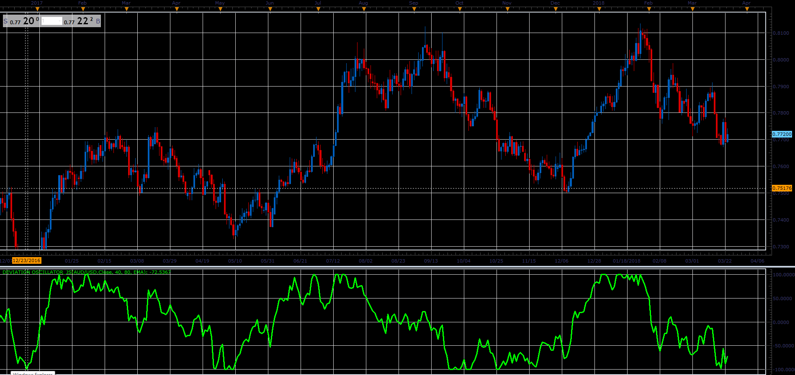

# Deviation Oscillator

> Source: https://fxcodebase.com/code/viewtopic.php?f=48&t=65983  
> Forum: 48 · Topic 65983 · 1 post(s)

---

## Deviation Oscillator

**Alexander.Gettinger** · Tue May 01, 2018 10:44 am

As volatility oscillator, will present the Price-MA difference
Normalized, within range of last N differences
pd:=C-Mov(C,x,E);
hpd:=Max(pd,x2);
lpd:=Min(pd,x2);
nf:=200/(hpd-lpd);
Deviation=((pd-lpd)*nf)-100

 

Download:

 [Deviation Oscillator_JS.jsl](files/118908/Deviation%20Oscillator_JS.jsl)
