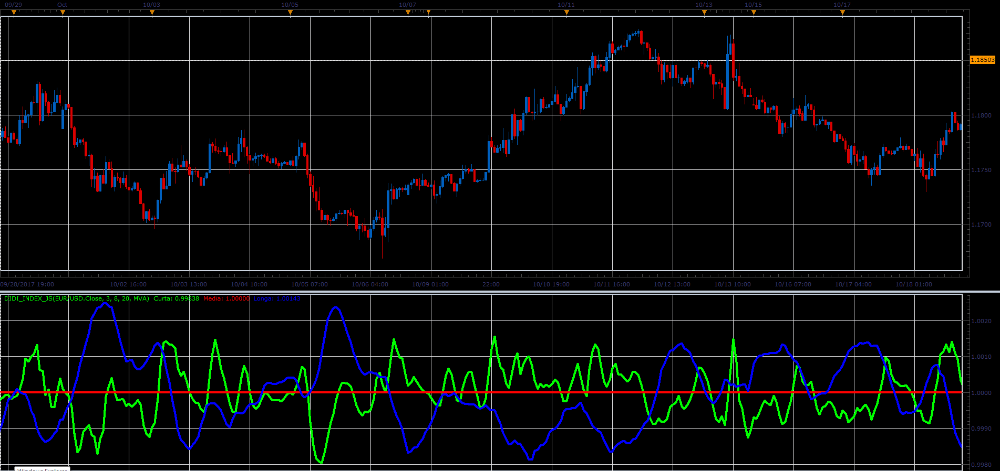

# Didi Index

> Source: https://fxcodebase.com/code/viewtopic.php?f=48&t=65539  
> Forum: 48 · Topic 65539 · 1 post(s)

---

## Didi Index

**Alexander.Gettinger** · Sat Jan 06, 2018 1:29 pm

Formulas:
Curta = MA(Curta_Period)/MA(Media_Period),
Media = 1,
Longa = MA(Longa_Period)/MA(Media_Period).

 

Download:

 [Didi_Index_JS.jsl](files/116818/Didi_Index_JS.jsl)

For this indicator must be installed Averages indicator ([viewtopic.php?f=17&t=2430](https://fxcodebase.com/code/viewtopic.php?f=17&t=2430)).
