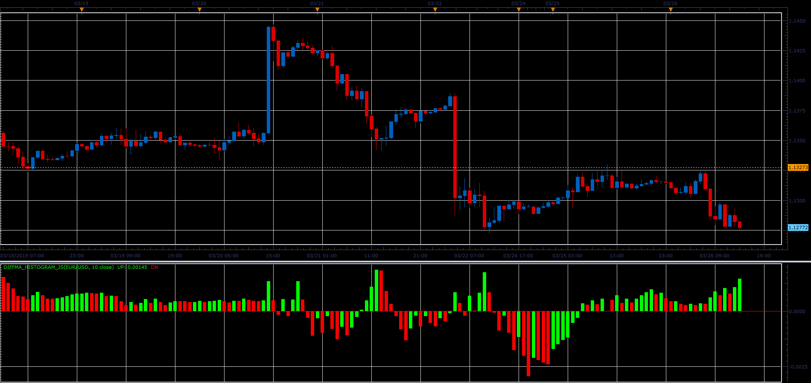

# Diff MA indicator

> Source: https://fxcodebase.com/code/viewtopic.php?f=48&t=68262  
> Forum: 48 · Topic 68262 · 1 post(s)

---

## Diff MA indicator

**Alexander.Gettinger** · Sat Mar 30, 2019 3:30 pm

The indicator looks like simple moving average (MVA) with some difference.
UP line is a MVA for [Period] last up-closed bars (close>open) and DN line is a MVA for [Period] last down-closed bars (close<open).
Diff MA Histogram is a difference between UP and DN lines.

 

Download:

 [DiffMA_Histogram_JS.jsl](files/125482/DiffMA_Histogram_JS.jsl)
