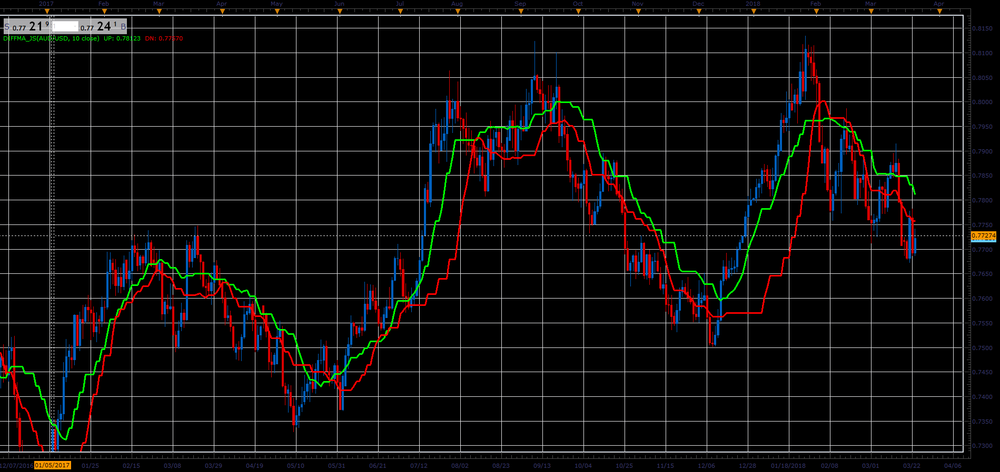

# Diff MA indicator

> Source: https://fxcodebase.com/code/viewtopic.php?f=48&t=65984  
> Forum: 48 · Topic 65984 · 1 post(s)

---

## Diff MA indicator

**Alexander.Gettinger** · Tue May 01, 2018 10:45 am

The indicator looks like simple moving average (MVA) with some difference.

UP line is a MVA for [Period] last up-closed bars (close>open) and DN line is a MVA for [Period] last down-closed bars (close<open).

 

Download:

 [DiffMA_JS.jsl](files/118909/DiffMA_JS.jsl)
