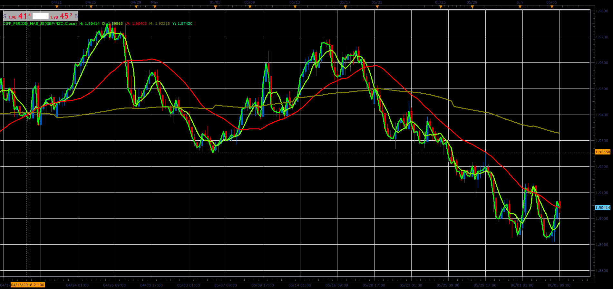

# Different period MAs

> Source: https://fxcodebase.com/code/viewtopic.php?f=48&t=66433  
> Forum: 48 · Topic 66433 · 1 post(s)

---

## Different period MAs

**Alexander.Gettinger** · Mon Aug 06, 2018 1:51 pm

The indicator draws hourly, daily, weekly, monthly and annual simple moving averages.

 

Download:

 [Diff_Period_MAs_JS.jsl](files/120364/Diff_Period_MAs_JS.jsl)
