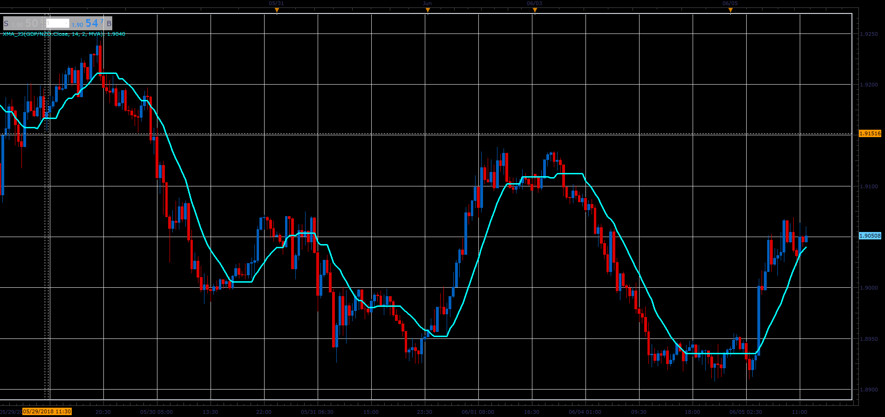

# Digital adaptive Moving Average (XMA)

> Source: https://fxcodebase.com/code/viewtopic.php?f=48&t=66472  
> Forum: 48 · Topic 66472 · 1 post(s)

---

## Digital adaptive Moving Average (XMA)

**Alexander.Gettinger** · Tue Aug 07, 2018 12:24 pm

Digital adaptive Moving Average XMA calculate Moving Averages with a digital filter.

Formulas:
XMA[i] = MA[i], if Abs(MA[i]-MA[i-1])>=Step, else
XMA[i] = XMA[i-1], where
MA - moving average with [Length] number of periods and [Method] type,
Abs - absolute value.

 

Download:

 [XMA_JS.jsl](files/120429/XMA_JS.jsl)
