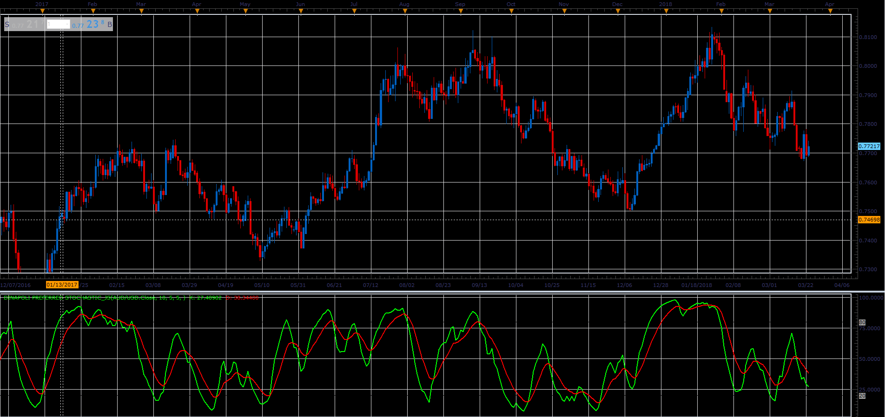

# Dinapoli Preferred Stochastic

> Source: https://fxcodebase.com/code/viewtopic.php?f=48&t=65985  
> Forum: 48 · Topic 65985 · 1 post(s)

---

## Dinapoli Preferred Stochastic

**Alexander.Gettinger** · Tue May 01, 2018 10:46 am

Basically, it is Stochastic, uses a slightly different Smoothing algorithm.

Formulas:
K[i] = K[i-1]+(FastK[i]-K[i-1])/D_Slowing,
D[i] = D[i-1]+(K[i]-D[i-1])/D_Length, where
FastK[i] = 100*(Close[i]-Min)/(Max-Min),
Max, Min - Maximum and minimum prices at range from (i-K_Length+1) to (i).

 

Download:

 [Dinapoli Preferred Stochastic_JS.jsl](files/118910/Dinapoli%20Preferred%20Stochastic_JS.jsl)
