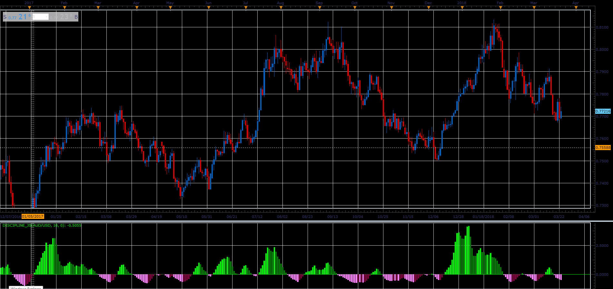

# Discipline oscillator

> Source: https://fxcodebase.com/code/viewtopic.php?f=48&t=65986  
> Forum: 48 · Topic 65986 · 1 post(s)

---

## Discipline oscillator

**Alexander.Gettinger** · Tue May 01, 2018 10:47 am

Formulas:
Discipline[i] = (Log(1+Value[i])/(1-Value[i])+Discipline[i-1])/2, where
Log - natural logarithm,
Value[i] = ((Price[i]-Min)/(Max-Min)-0.5*Value[i-1])*2/3,
Max, Min - maximum and minimum price at range from (i-Period+1) to i.

 

Download:

 [Discipline_JS.jsl](files/118911/Discipline_JS.jsl)
