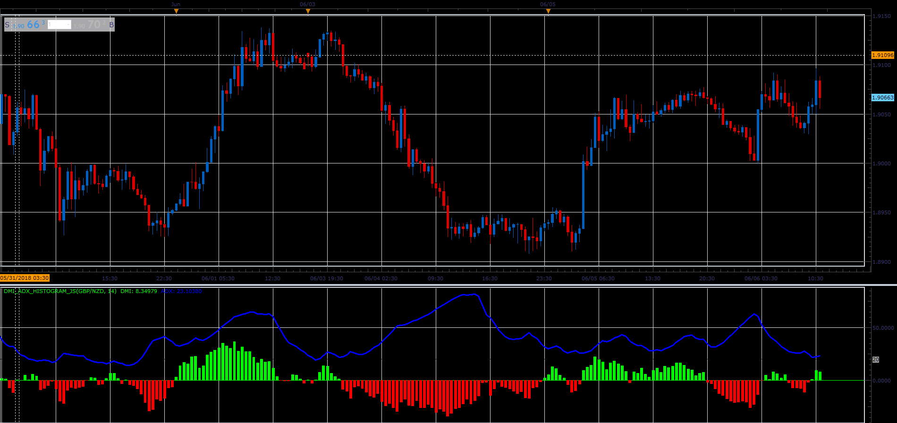

# DMI ADX histogram oscillator

> Source: https://fxcodebase.com/code/viewtopic.php?f=48&t=66522  
> Forum: 48 · Topic 66522 · 1 post(s)

---

## DMI ADX histogram oscillator

**Alexander.Gettinger** · Wed Aug 15, 2018 2:27 pm

Histogram is a difference between DMI+ and DMI-.
Also oscillator draw ADX indicator in same window.

 

Download:

 [DMI_ADX_Histogram_JS.jsl](files/120584/DMI_ADX_Histogram_JS.jsl)
