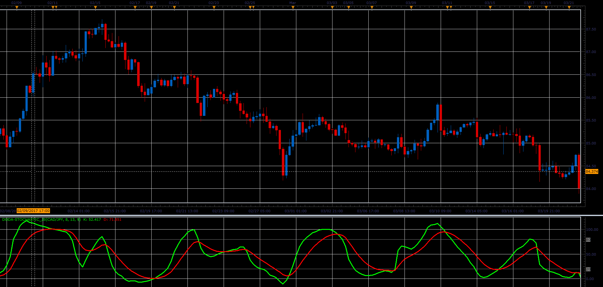

# Doda-Stochastic

> Source: https://fxcodebase.com/code/viewtopic.php?f=48&t=64773  
> Forum: 48 · Topic 64773 · 1 post(s)

---

## Doda-Stochastic

**Alexander.Gettinger** · Tue Jun 06, 2017 1:49 pm

R is Stochastic(Price),
K is Stochastic(R),
D is MA(K).

 

Download:

 [Doda-Stochastic_JS.jsl](files/112792/Doda-Stochastic_JS.jsl)
