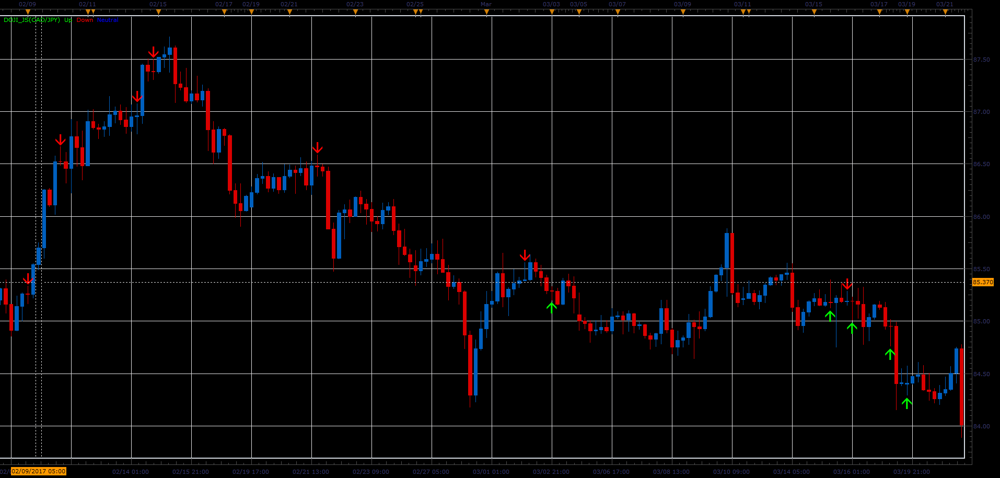

# Doji Bar

> Source: https://fxcodebase.com/code/viewtopic.php?f=48&t=64774  
> Forum: 48 · Topic 64774 · 1 post(s)

---

## Doji Bar

**Alexander.Gettinger** · Tue Jun 06, 2017 1:53 pm

Doji is generally an indicator of market indecision.
Open and Close Prices of Doji are same or very close to one another.
And as such, do not give the trading signals.
However, they may be an indication of weakening trend
and point to the possibility of changes in trend.
Indicator recognizes only Two Doji pattern, Dragonfly and Gravestone Doji.

 

Download:

 [Doji_JS.jsl](files/112793/Doji_JS.jsl)
