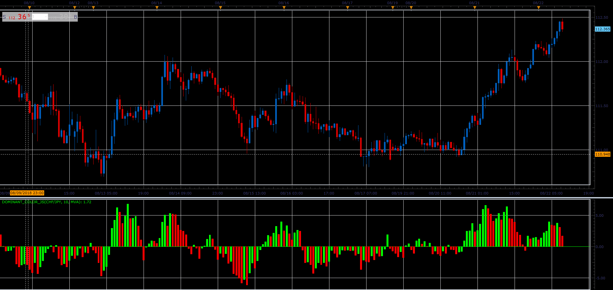

# Dominant color oscillator

> Source: https://fxcodebase.com/code/viewtopic.php?f=48&t=66968  
> Forum: 48 · Topic 66968 · 1 post(s)

---

## Dominant color oscillator

**Alexander.Gettinger** · Sat Nov 24, 2018 12:24 pm

The indicator helps to determine the dominant direction of closure of bars.

Formulas:
DC = MA(Diff), where
Diff = Close-Open.

 

Download:

 [Dominant_Color_JS.jsl](files/122296/Dominant_Color_JS.jsl)

For this indicator must be installed Averages indicator ([viewtopic.php?f=17&t=2430](https://fxcodebase.com/code/viewtopic.php?f=17&t=2430)).
