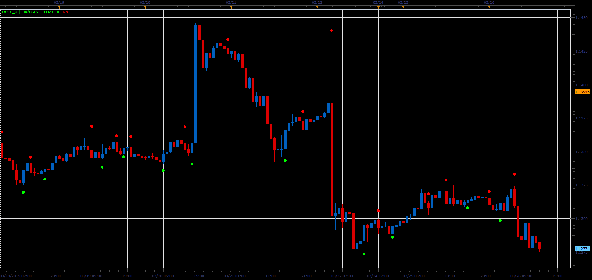

# Dots indicator

> Source: https://fxcodebase.com/code/viewtopic.php?f=48&t=68263  
> Forum: 48 · Topic 68263 · 3 post(s)

---

## Dots indicator

**Alexander.Gettinger** · Sat Mar 30, 2019 3:32 pm

Formulas:
UP - if MA(i)>MA(i-1) and MA(i-1)>MA(i-2),
DN - if MA(i)<MA(i-1) and MA(i-1)<MA(i-2).

The moving average is calculated for a Close price.

 

Download:

 [Dots_JS.jsl](files/125483/Dots_JS.jsl)

---

## Re: Dots indicator

**lowcoloured** · Fri May 29, 2020 3:18 am

Does it repaint?

---

## Re: Dots indicator

**Apprentice** · Fri May 29, 2020 4:31 am

It Does not.
