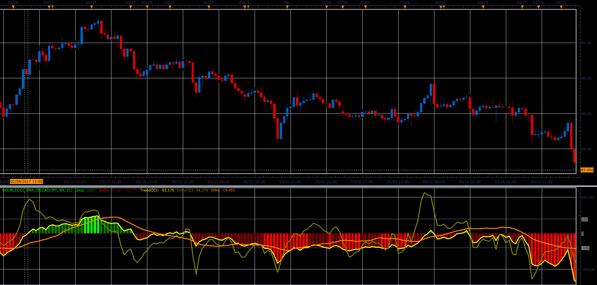

# Double CCI with EMA

> Source: https://fxcodebase.com/code/viewtopic.php?f=48&t=64779  
> Forum: 48 · Topic 64779 · 1 post(s)

---

## Double CCI with EMA

**Alexander.Gettinger** · Mon Jun 12, 2017 10:40 am

The indicator shows two, short (entry) and long (trend) CCI indicators, and shows histogram which simplifies detection of the +/-100 levels for trend CCI.

 

Download:

 [DoubleCCI_EMA_JS.jsl](files/112849/DoubleCCI_EMA_JS.jsl)
