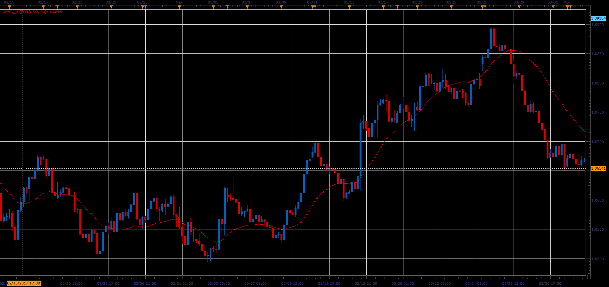

# Double exponential moving average

> Source: https://fxcodebase.com/code/viewtopic.php?f=48&t=64708  
> Forum: 48 · Topic 64708 · 1 post(s)

---

## Double exponential moving average

**Alexander.Gettinger** · Fri Jun 02, 2017 1:33 pm

Double exponential moving average (DEMA).

Formula:
DEMA = 2*EMA(Price)-EMA(EMA(Price)), where
EMA - exponential moving average with [Period] number of periods.

 

Download:

 [DEMA_JS.jsl](files/112697/DEMA_JS.jsl)
