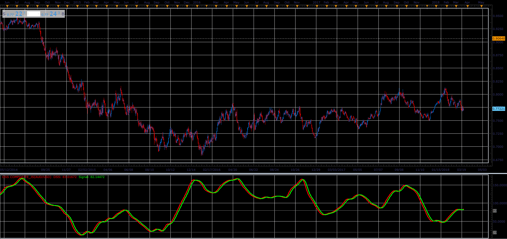
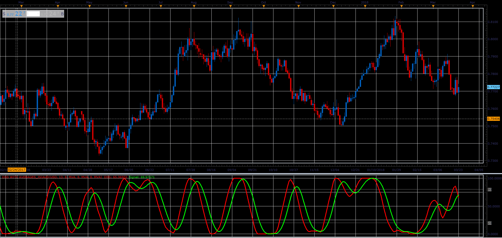

# Double Smoothed Stochastic (DSS)

> Source: https://fxcodebase.com/code/viewtopic.php?f=48&t=65989  
> Forum: 48 · Topic 65989 · 2 post(s)

---

## Double Smoothed Stochastic (DSS)

**Alexander.Gettinger** · Tue May 01, 2018 10:53 am

DSS Formulas is similar to the that of stochastic indicator.
William Blau and Walter Bressert presented different version of the Double Smoothed Stochastics.
Above 80 is Overbought area.
Below 20 is oversold area.

 

Download:

 [DSS Composite_JS.jsl](files/118914/DSS%20Composite_JS.jsl)

---

## Re: Double Smoothed Stochastic (DSS)

**Alexander.Gettinger** · Tue May 01, 2018 10:56 am

**Double Smoothed Stochastic with Averages:**

 

Download:

 [DSS with Averages_JS.jsl](files/118915/DSS%20with%20Averages_JS.jsl)
