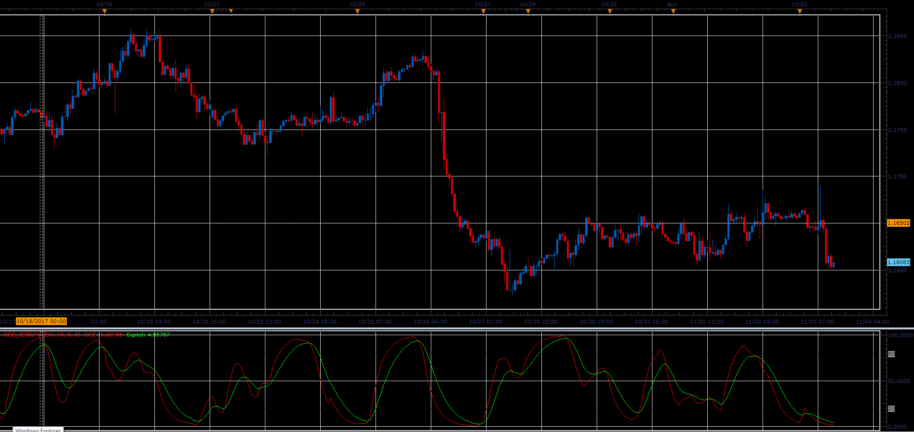

# Double Smoothed Stochastic (DSS)

> Source: https://fxcodebase.com/code/viewtopic.php?f=48&t=65540  
> Forum: 48 · Topic 65540 · 1 post(s)

---

## Double Smoothed Stochastic (DSS)

**Alexander.Gettinger** · Sat Jan 06, 2018 1:30 pm

DSS Formulas is similar to the that of stochastic indicator.

William Blau and Walter Bressert presented different version of the Double Smoothed Stochastics.

Above 80 is Overbought area.
Below 20 is oversold area.

 

Download:

 [DSS_JS.jsl](files/116819/DSS_JS.jsl)
