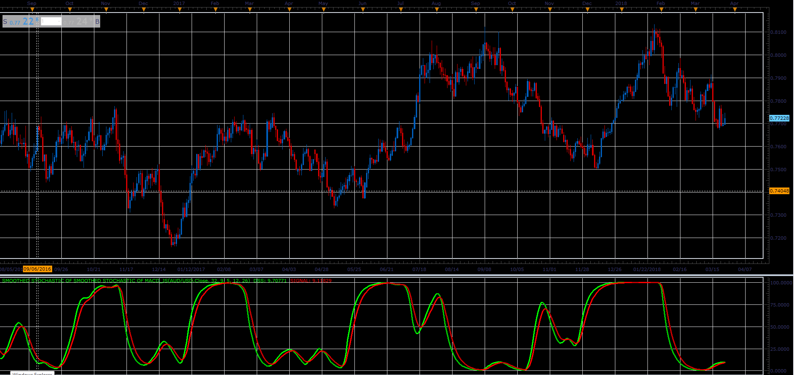

# Double smoothed stochastic of MACD

> Source: https://fxcodebase.com/code/viewtopic.php?f=48&t=66024  
> Forum: 48 · Topic 66024 · 1 post(s)

---

## Double smoothed stochastic of MACD

**Alexander.Gettinger** · Tue May 01, 2018 1:56 pm

Formulas:
DSS[i] = DSS[i-1]+Beta*(DDS3-DSS[i-1]),
Signal[i] = Signal[i-1]+Alpha*(DSS[i]-Signal[i-1]), where
DDS3 = 100*(DDS2-Min2)/(Max2-Min2),
Max, Min - maximum and minimum values of DDS2 at range from (i-Stoch_Length+1) to (i),
DDS2[i] = DDS2[i-1]+Beta*(DDS1-DDS2[i-1]),
DDS1 = 100*(MACD-Min1)/(Max1-Min1),
Max1. Min1 - maximum and minimum values of MACD at range from (i-Stoch_Length+1) to (i),
Alpha = 2/(1+Signal_EMA),
Beta = 2/(1+Smooth_EMA).

 

Download:

 [Smoothed Stochastic of Smoothed Stochastic of MACD_JS.jsl](files/118952/Smoothed%20Stochastic%20of%20Smoothed%20Stochastic%20of%20MACD_JS.jsl)
