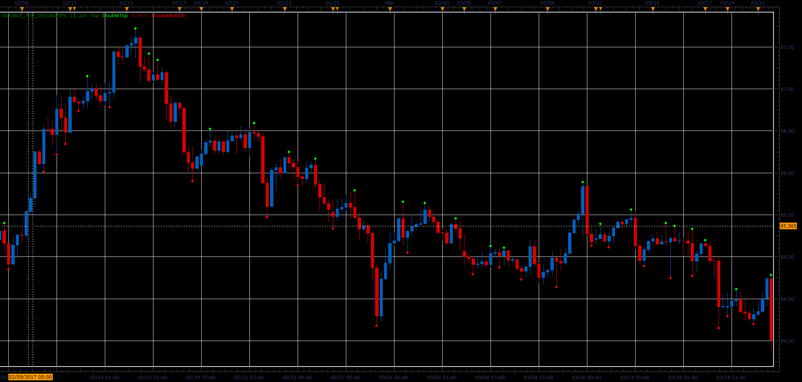

# Double top indicator

> Source: https://fxcodebase.com/code/viewtopic.php?f=48&t=64775  
> Forum: 48 · Topic 64775 · 1 post(s)

---

## Double top indicator

**Alexander.Gettinger** · Tue Jun 06, 2017 1:54 pm

The indicator finds single and double top and bottom patterns.
In the indicator parameters are specified:
- minimum height/depth,
- the maximum distance between the tops/bottoms (for twin tops/bottoms),
- the minimum number of bars after the top/bottom.

 

Download:

 [Double_Top_JS.jsl](files/112794/Double_Top_JS.jsl)
