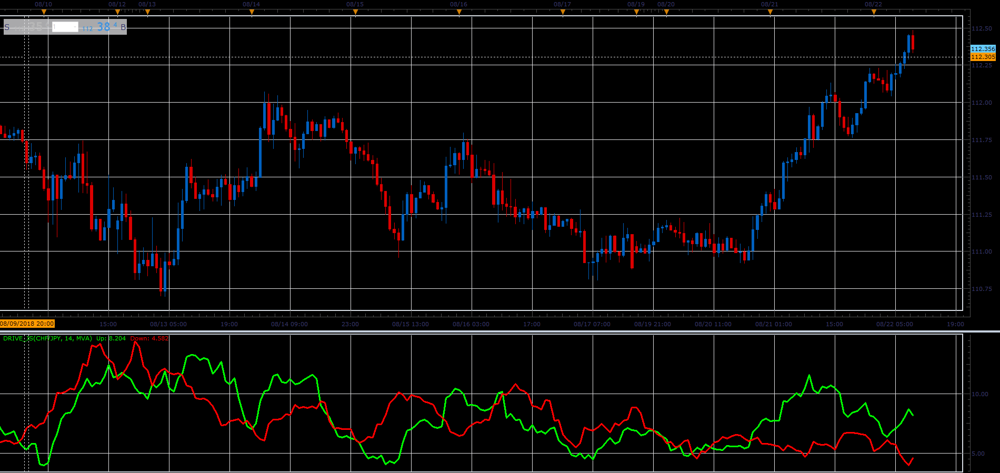

# Drive oscillator

> Source: https://fxcodebase.com/code/viewtopic.php?f=48&t=66969  
> Forum: 48 · Topic 66969 · 4 post(s)

---

## Drive oscillator

**Alexander.Gettinger** · Sat Nov 24, 2018 12:25 pm

Up (Green) = ((High - Open) + (Close - Low))/2, averaged for the selected period;
Down (Red) = ((Open - Low) + (High - Close))/2, averaged for the selected period.

 

Download:

 [Drive_JS.jsl](files/122297/Drive_JS.jsl)

---

## Re: Drive oscillator

**hahajason** · Sun Mar 14, 2021 10:06 am

is there MT4 version of this indicator?
Thanks

---

## Re: Drive oscillator

**Apprentice** · Thu Mar 18, 2021 5:10 am

Your request is added to the development list.
Development reference 296.

---

## Re: Drive oscillator

**Apprentice** · Mon Mar 22, 2021 4:27 am

Try this version.
[viewtopic.php?f=38&t=59350](https://fxcodebase.com/code/viewtopic.php?f=38&t=59350)
