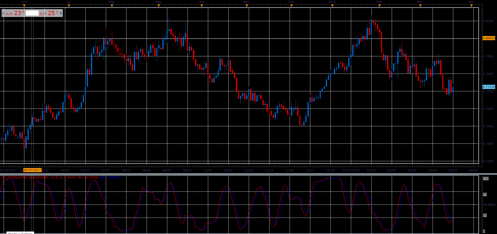

# DT Oscillator

> Source: https://fxcodebase.com/code/viewtopic.php?f=48&t=65990  
> Forum: 48 · Topic 65990 · 1 post(s)

---

## DT Oscillator

**Alexander.Gettinger** · Tue May 01, 2018 10:58 am

This oscillator is written on Robert Miner's book "High Probability Trading Strategies".

 

Download:

 [DT_Oscillator_JS.jsl](files/118916/DT_Oscillator_JS.jsl)

For this oscillator must be installed Averages indicator ([viewtopic.php?f=17&t=2430](https://fxcodebase.com/code/viewtopic.php?f=17&t=2430)).
