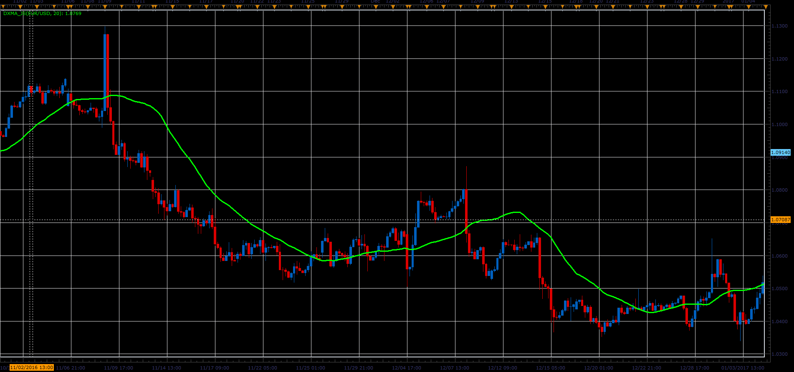

# DXMA indicator

> Source: https://fxcodebase.com/code/viewtopic.php?f=48&t=64713  
> Forum: 48 · Topic 64713 · 1 post(s)

---

## DXMA indicator

**Alexander.Gettinger** · Fri Jun 02, 2017 1:47 pm

Formulas:
DXMA[i]=Averages(C) in the range from i-Period to i, where
C[i]=(h-l)*ydi*0.01+l.
h and l is a maximum and minimum prices in the range from i-Period to i,
ydi=(DMI+)-(DMI-)+50.

 

Download:

 [DXMA_JS.jsl](files/112702/DXMA_JS.jsl)
