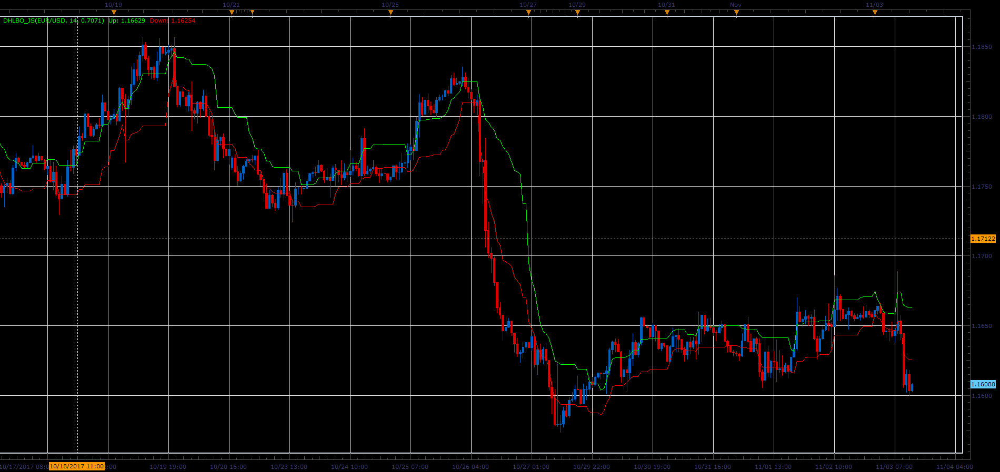
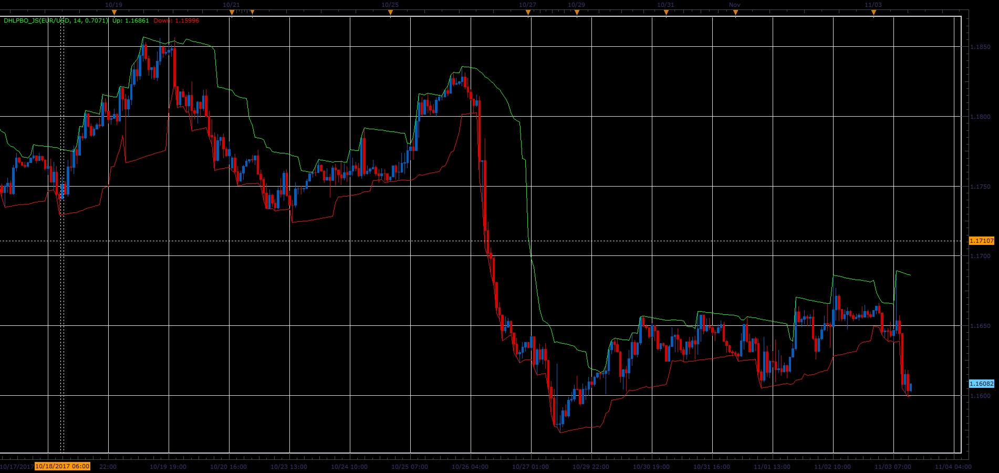

# Dynamic High/Low Band Overlay

> Source: https://fxcodebase.com/code/viewtopic.php?f=48&t=65538  
> Forum: 48 · Topic 65538 · 1 post(s)

---

## Dynamic High/Low Band Overlay

**Alexander.Gettinger** · Sat Jan 06, 2018 1:27 pm

**DHLBO:**

Formulas:
Up band = Min+(Max-Min)*Step,
Dn band = Max-(Max-Min)*Step, where
Min, Max - minimum and maximum prices at range from (i-Look_Back_Length+1) to (i).

 

Download:

 [DHLBO_JS.jsl](files/116817/DHLBO_JS.jsl)

**DHLPBO:**

Formulas:
Up band[i] = Max-(Max-Min)*(MaxIndex-i)*Step/100,
Dn band[i] = Min+(Max-Min)*(MinIndex-i)*Step/100, where
Min, Max - minimum and maximum prices at range from (i-Look_Back_Length+1) to (i),
MinIndex, MaxIndex - positions of Min and Max.

 

Download:

 [DHLPBO_JS.jsl](files/116817/DHLPBO_JS.jsl)
