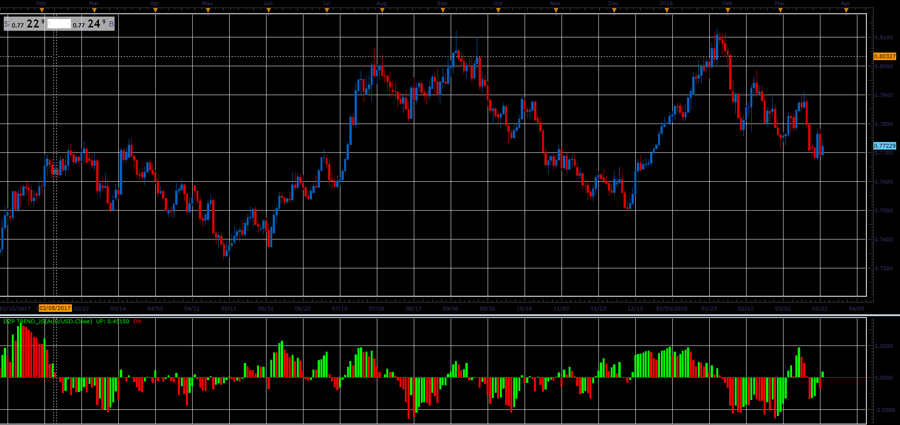

# DZP Trend

> Source: https://fxcodebase.com/code/viewtopic.php?f=48&t=65992  
> Forum: 48 · Topic 65992 · 1 post(s)

---

## DZP Trend

**Alexander.Gettinger** · Tue May 01, 2018 11:04 am

Formula:
A[i]=(Close[i]-Close[i-M])/Close[i-M];
B[i]=(EMA[i]-EMA[i-M])/EMA[i-M];
DZP=(A-B)*100.

 

Download:

 [DZP Trend_JS.jsl](files/118918/DZP%20Trend_JS.jsl)
